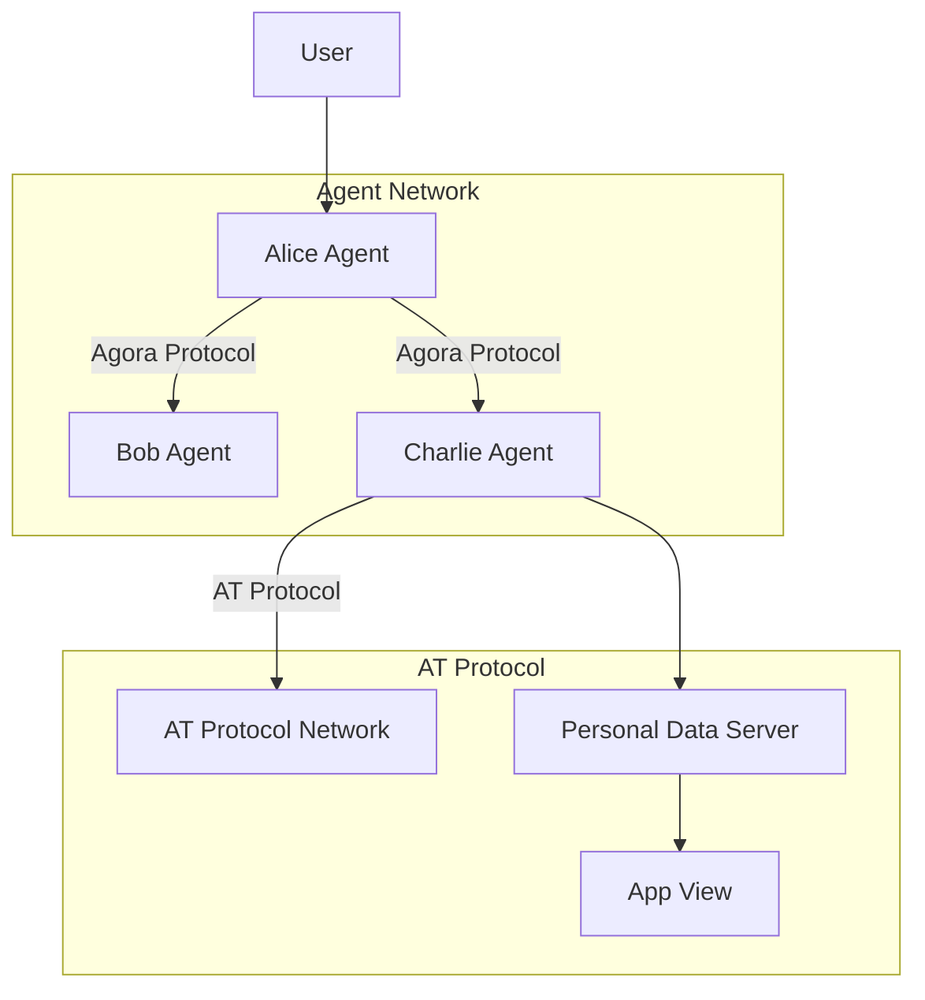

# AGORA ON AT: IMPLEMENTATION GUIDE

*This guide is a living document that will be updated throughout the hackathon*

## MISSION PARAMETERS

This guide documents our journey to integrate Agora Protocol with AT Protocol. Consider it your technical grimoire as we build a decentralized agent network that interfaces with AT Protocol's social ecosystem.

```
STATUS: UNDER CONSTRUCTION
CLEARANCE: PUBLIC
```

## OPERATIONAL PHASES

### PHASE 1: RECONNAISSANCE & INTELLIGENCE GATHERING 
*[IN PROGRESS]*

- Understanding protocol architectures
- Identifying integration points
- Setting up development environment

### PHASE 2: AGENT IDENTITY ESTABLISHMENT
*[PENDING]*

- Creating DIDs for agents
- Setting up AT Protocol repositories
- Establishing authentication flows

### PHASE 3: COMMUNICATION CHANNELS
*[PENDING]*

- Implementing Agora protocol messaging
- Building AT Protocol adapters
- Creating the bridge between protocols

### PHASE 4: PROTOCOL NEGOTIATION
*[PENDING]*

- Implementing efficient protocol negotiation
- Storing negotiated protocols in repositories
- Optimizing cross-protocol communication

### PHASE 5: FIELD OPERATIONS
*[PENDING]*

- Deploying agent network
- Testing real-world scenarios
- Measuring efficiency gains

## TECHNICAL ARCHITECTURE



## IMPLEMENTATION NOTES

*Field notes will be added as we progress through implementation*

## SECURITY CONSIDERATIONS

*Security measures and considerations will be documented here*

## EFFICIENCY METRICS

*Performance benchmarks and optimization results will be recorded here*
